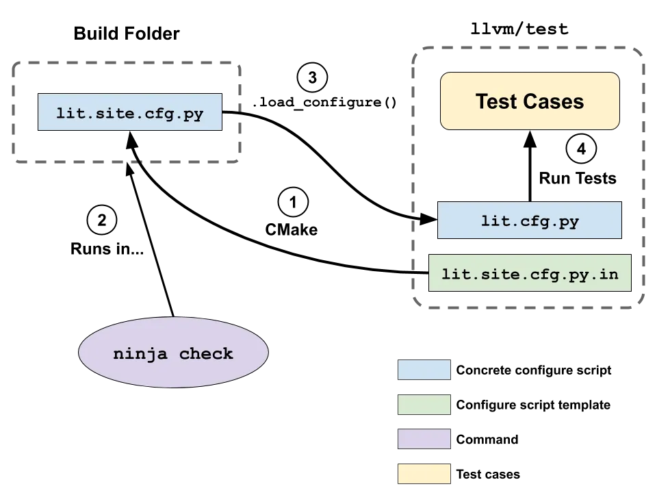

# LLVM-LIT Test Practice

Practice project for **LLVM LIT testing** (out-of-tree): setting up `llvm-lit`, `FileCheck`, and LIT config (`lit.cfg.py`, `lit.site.cfg.py`) as in **Part 3** of [*LLVM Techniques, Tips, and Best Practices: Clang and Middle-End Libraries*](https://www.amazon.com/Techniques-Practices-Clang-Middle-End-Libraries/dp/1838824952).

> A small **js-minifier** program is used as the tool-under-test; the **theme of this repo is LIT**, not the minifier itself. The `js-minifier` binary is **AI-generated example code** for the exercise only.

The **official code repo** for the book is [PacktPublishing/LLVM-Techniques-Tips-and-Best-Practices-Clang-and-Middle-End-Libraries](https://github.com/PacktPublishing/LLVM-Techniques-Tips-and-Best-Practices-Clang-and-Middle-End-Libraries). It does not include Part 3 (LIT out-of-tree) material, so this repo exists to fill that gap.

## LIT setup overview



*Diagram ref: [Using LLVM LIT Out-of-Tree - 
Min-Yih Hsu](https://medium.com/@mshockwave/using-llvm-lit-out-of-tree-5cddada85a78)*

## Requirements

- CMake ≥ 3.10
- A C++ compiler (e.g. g++, clang++)
- A built or installed LLVM (with `llvm-lit` and `FileCheck`)

## Build

```bash
mkdir build && cd build
cmake ..
make
```

This produces the `build/js-minifier` executable.

## Running tests (LIT)

Tests use your LLVM build’s `llvm-lit` and `FileCheck`. By default the tools are looked up under `~/llvm/llvm-project/build`. Override with:

- `LLVM_BUILD_DIR` — LLVM build directory (default: `~/llvm/llvm-project/build`)
- `LLVM_BIN` — Direct path to the directory containing the tools (e.g. `.../build/bin`)

**From the project build directory:**

```bash
cd build
~/llvm/llvm-project/build/bin/llvm-lit -sv test
```

Or from the test directory:

```bash
cd build/test
~/llvm/llvm-project/build/bin/llvm-lit -sv .
```

## Running js-minifier manually

```bash
./build/js-minifier path/to/input.js -o -          # output to stdout
./build/js-minifier path/to/input.js -o output.js  # output to file
```

## Project layout

- `src/js-minifier.cpp` — Minifier executable (AI-generated example)
- `test/` — LIT tests (`lit.cfg.py`, `lit.site.cfg.py.in`, `test.js`)

## Reference / Further reading

- **Book repo (official):** [PacktPublishing/LLVM-Techniques-Tips-and-Best-Practices-Clang-and-Middle-End-Libraries](https://github.com/PacktPublishing/LLVM-Techniques-Tips-and-Best-Practices-Clang-and-Middle-End-Libraries) — book code; Part 3 (LIT) not included, hence this repo
- **Book:** [*LLVM Techniques, Tips, and Best Practices: Clang and Middle-End Libraries*](https://www.amazon.com/Techniques-Practices-Clang-Middle-End-Libraries/dp/1838824952) (Amazon) — Part 3: Testing with LLVM LIT / Using LIT in out-of-tree projects
- **Article:** [Using LLVM LIT Out-of-Tree](https://medium.com/@mshockwave/using-llvm-lit-out-of-tree-5cddada85a78) (Medium, @mshockwave) — good to read alongside the book
